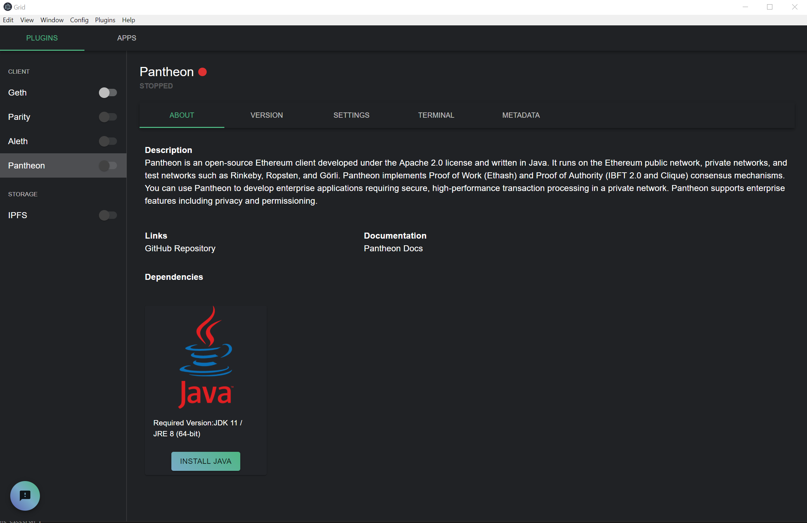
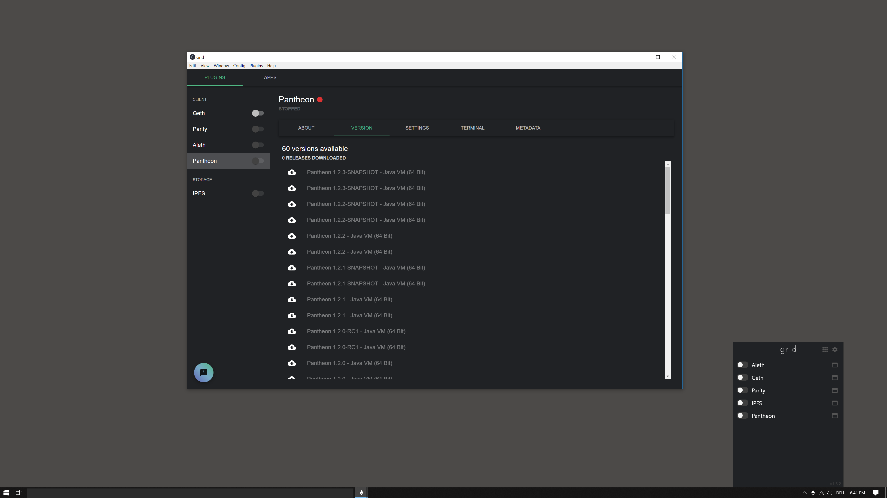

# Pantheon Grid Integration

This plugin allows you to install and use [Pantheon](https://docs.pantheon.pegasys.tech/en/latest/) in [Ethereum Grid](http://grid.ethereum.org).

# Progress

- [x] Get releases from Bintray
- [ ] Download packed Jar files from Bintray
- [ ] Verify Signature
- [ ] Extract all Jar files
- [x] Detect JDK (80% windows, 0% others)
- [x] Install JDK with elevated process (windows)
- [ ] Install JDK (others)
- [x] Specify plugin + dependency (this repo)
- [x] Detect Java dependency in Grid 
- [ ] Run Java setup in Grid if Pantheon is installed (if necessary)
- [x] Generate flags for the JVM and Pantheon start (might need extra plugin metadata)
- [x] Start java.exe (the dependency not binary) with flags and monitor process (windows)
- [ ] Start java with flags and monitor process (others)

# Screenshots
## About Page


## Bintray Release List + Nano


## Run


# Implementation
`index.js`
```
module.exports = {
  name: 'pantheon',
  displayName: 'Pantheon',
  type: 'client',
  // repository: 'https://bintray.com/consensys/pegasys-repo/pantheon', // ideally it would point to bintray package
  repository: 'https://github.com/PhilippLgh/grid-pantheon-plugin', // github mirror while bintray not working
  dependencies: {
    runtime: [ // new Grid API for runtime dependency
      {
        name: 'Java', // JRE default
        version: '8'
      }
    ]
  },
  settings: [
    // TODO needs feedback about best defaults and most important settings
  ],
  about: {
    description: `
    Pantheon is an open-source Ethereum client developed under the Apache 2.0 license and written in Java. It runs on the Ethereum public network, private networks, and test networks such as Rinkeby, Ropsten, and Görli. Pantheon implements Proof of Work (Ethash) and Proof of Authority (IBFT 2.0 and Clique) consensus mechanisms.

    You can use Pantheon to develop enterprise applications requiring secure, high-performance transaction processing in a private network.

    Pantheon supports enterprise features including privacy and permissioning.
    `,
    links: [
      {
        name: 'GitHub Repository',
        url: 'https://github.com/PegaSysEng/pantheon'
      }
    ],
    docs: [
      {
        name: 'Pantheon Docs',
        url: 'https://docs.pantheon.pegasys.tech/en/latest/'
      }
    ]

  }
}
```

# Challenges / Issues
see issues
- Bintray support not fully implemented in [electron-app-manager](https://github.com/PhilippLgh/electron-app-manager) -> use github mirror
  - failing test https://github.com/PhilippLgh/electron-app-manager/commit/80bf84fdf99ec1dafec046fbac1cd811259a79d4#diff-e7bde8dfb0840fa786d7adbef653fc7aR14
  - run with `yarn test:downloader`
  - has no `prefix` option for the api endpoint -> thousands of file entries need to be fetched & filtered client-side 
- Pantheon GitHub releases contains only source
- Couldn't find out the PGP public keys for the corresponsing `.asc` files
- Java installer
  - spawn causes `EACCES` error
  - needs elevated shell / native module to spawn elevated shell on windows (not tested on other OS)
    - native modules need to be compiled with electron headers
    - alternative: manual java installation (see screenshot above: "install java" could open browser and download installer)
  - shows a license dialog which can be surpressed with switches `/s`
  - JDK installer does not set JAVA_HOME or PATH which is used for detection
  - download produced occasional `ECONNRESET`
  - user needs to agree / disagree license somehow
- JRE (`jre-8u221-windows-x64.exe`) seems **not** to be working
  - `Unrecognized option: --add-opens`
- Grid is not handling the installation of a 32 bit or older JRE (https://docs.pantheon.pegasys.tech/en/latest/HowTo/Get-Started/Install-Binaries/)
- All jar files / contents of package need to be extracted. Usually grid extracts only the executable **before every** start and does a signature check to avoid swapped executables
- Not sure if Grid should replicate the `bin/pantheon` script behavior e.g. start Java with flags etc or run scripts instead
  - Plugin needs to specify `classpath` setting in this case based on extraction location
  - Grid-UI should allow to configure JVM as well as Pantheon in this case "Add default JVM options here. You can also use JAVA_OPTS and PANTHEON_OPTS to pass JVM options to this [start] script."


# How to use 
not possible yet
- [Download Grid](https://grid.ethereum.org/)
- Run Grid
- Click on settings icon
- Click on edit config
- Add TODO
- Click Save
- Click Restart